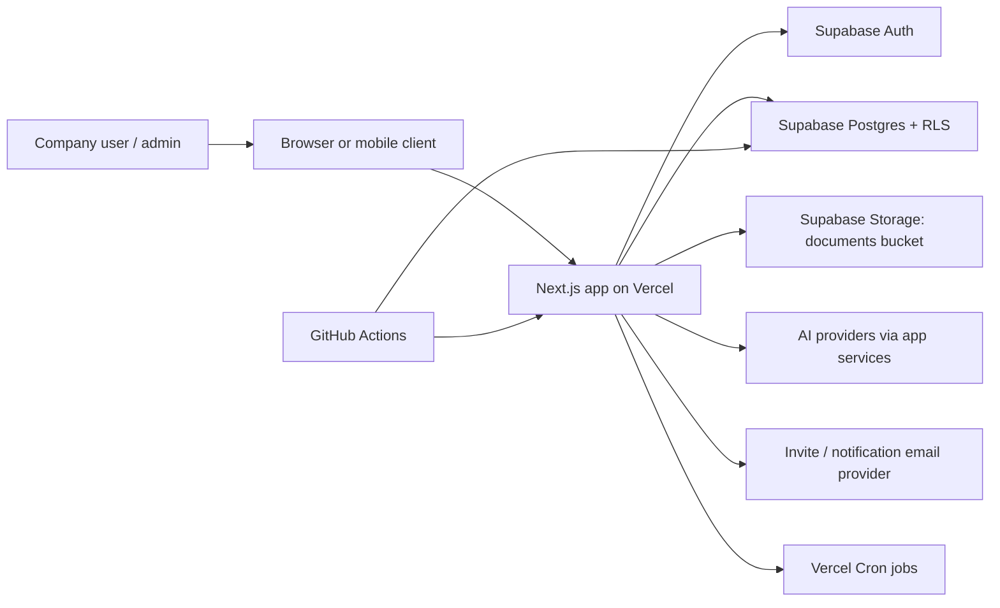

# Architecture Diagram

| Component | Status | Evidence | Notes |
| --- | --- | --- | --- |
| Next.js app routes, API handlers, and app shell are in this repo. | Verified | [app](../../app), [components](../../components) | Confirm deployed commit SHA in Vercel before sharing. |
| Vercel cron routes are configured for recurring backend jobs. | Verified | [vercel.json](../../vercel.json), [API RBAC audit](../api-rbac-audit.md) | Cron secret configuration needs dashboard evidence. |
| Supabase Postgres stores company, jobsite, document, billing, risk, audit, and readiness data. | Partial | [Supabase migrations](../../supabase/migrations) | Hosted schema drift must be checked before release. |
| Supabase Storage uses signed URLs for document/report/evidence access. | Partial | [report export route](../../app/api/company/reports/export/route.ts), [attachment upload URL route](../../app/api/company/reports/[id]/attachments/upload-url/route.ts) | Bucket policy and retention evidence require Supabase dashboard review. |
| GitHub Actions are available as CI evidence. | Verified | [.github/workflows](../../.github/workflows) | Confirm latest successful run before sending packet. |

