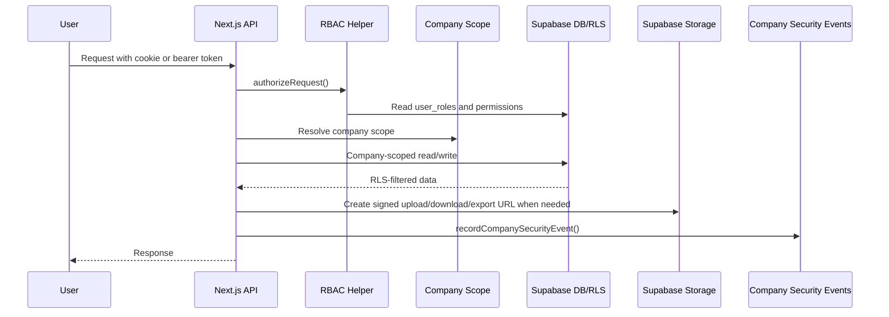

# Data Flow Diagram

| Flow | Status | Evidence | Notes |
| --- | --- | --- | --- |
| API requests authorize before company data access. | Partial | [lib/rbac.ts](../../lib/rbac.ts), [API RBAC audit](../api-rbac-audit.md) | Some public/proxy/shared-auth exceptions remain documented. |
| Company scope is resolved from server-side role/membership state, not only client input. | Verified | [lib/companyScope.ts](../../lib/companyScope.ts) | Platform admin company selectors need careful review route by route. |
| Data request tracking is company-scoped and logged to the security event ledger. | Verified | [data request API](../../app/api/company/data-requests/route.ts), [data request patch API](../../app/api/company/data-requests/[id]/route.ts) | Requires migration deployment. |
| File access uses signed upload/download/export URLs instead of public bucket URLs. | Partial | [report export route](../../app/api/company/reports/export/route.ts), [field audit upload URL](../../app/api/company/field-audits/observations/[id]/upload-url/route.ts) | Exact signed URL TTLs differ by route and need normalization. |

